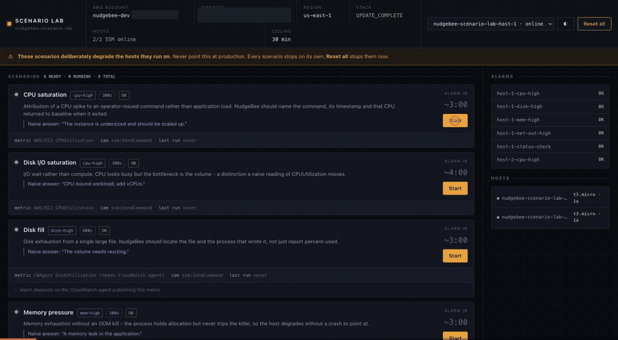

# NudgeBee Scenario Lab

**See what NudgeBee does during a real incident — without waiting for one.**

This sets up a few small, throwaway servers in your own AWS account, then lets
you break them on purpose. High CPU. Full disk. A service that won't start.
NudgeBee notices, investigates, and explains what happened — and you get to
watch it work on a problem you created thirty seconds ago.

Everything is temporary. Every scenario stops by itself, one button puts
everything back, and deleting the lab takes one command.



*Pick a scenario, press Start, and the alarm goes red about three minutes
later — the same alarm NudgeBee picks up and investigates.*

---

## Is this safe?

Yes, with one rule: **use a test or sandbox AWS account, not production.**

The scenarios deliberately overload the servers they run on. That's the point.
But they only ever touch the servers this lab creates, and:

- Every scenario stops on its own after a few minutes
- **Reset everything** stops them all immediately and cleans up
- The lab, database and services tiers open nothing to the internet — no
  inbound access at all
- Nothing here reads or touches anything else in your account

The one exception is the optional **load balancer tier**, and it is inherent to
what that tier demonstrates: a front door has to be reachable before losing it
means anything, so it puts an internet-facing load balancer on port 80 and
accepts traffic from anywhere by default. What's behind it is a health endpoint
that returns a single line of text. Narrow `AllowedClientCidr` to your own
address range when you deploy it if you'd rather not have that open, or skip the
tier — everything else works without it.

## What it costs

You choose how much of the lab to build. Only the first part is required.

| Part | What it adds | Cost if left running |
|---|---|---|
| **Lab** (required) | Two small servers, eight scenarios | ~$19/month |
| Database | One PostgreSQL server, six more scenarios | +$15/month |
| Services | Three servers that depend on each other | +$60/month |
| Load balancer | A front door that can be cut off | +$18/month |

Everything: about **$110 a month**. Just the lab: about **$19**, roughly two
coffees.

You'll almost certainly delete it the same day, and a few hours costs cents —
but the numbers above are what you pay if you forget. Deleting is one command
and billing stops immediately.

---

## Before you start

You need three things on your machine. If any are missing, the first command
fails with something like `command not found` — that's this, not a broken lab.

**1. The AWS command line tool.**
[Install it here](https://aws.amazon.com/cli/), then check it worked:

```bash
aws --version
```

**2. AWS credentials.** Run `aws configure` and paste in the access key and
secret for a **test or sandbox account** — not production. Then check:

```bash
aws sts get-caller-identity
```

That should print an account number. If it prints an error, the credentials
aren't set up yet and nothing else will work.

**If you keep several AWS accounts on one machine** — most people do — put the
sandbox one in a named profile and point the lab at it with `AWS_PROFILE`:

```bash
aws configure --profile sandbox      # or: aws sso login --profile sandbox
export AWS_PROFILE=sandbox
aws sts get-caller-identity
```

Set it once, in the terminal you're going to work in, and every command below
uses it — including the control panel, which reads the same profile your CLI
does. Same for the region, if the lab shouldn't go in `us-east-1`:

```bash
export AWS_REGION=eu-west-1
```

Every script prints the account it's about to act on before it changes
anything. Read that line. It's the one check that catches "wrong profile" while
it's still free.

**3. Python 3.9 or newer**, for the control panel:

```bash
python3 --version
```

Macs and most Linux machines already have it.

**On Windows?** Use WSL (Windows Subsystem for Linux) and follow the Linux
steps inside it. The scripts are shell scripts and won't run in PowerShell.

**One more thing, and it's the one people miss:** this AWS account has to be
connected to NudgeBee already, or you'll break things correctly and see nothing.
`./scripts/preflight.sh` checks that for you and says so plainly. If it reports
the account isn't connected, connect it in NudgeBee first — the lab has no way
to do that for you.

---

## Getting started

You'll need someone who can run commands on a Mac or Linux machine and has
access to your AWS account. It takes about ten minutes.

### 1. Check your account is ready

```bash
./scripts/preflight.sh
```

This only looks — it changes nothing. It tells you whether your AWS account
has the permissions the lab needs, and whether NudgeBee is set up to receive
alerts from it.

### 2. Create the lab

```bash
./scripts/deploy.sh
```

Takes about four minutes. It asks nothing and needs no configuration — it
builds its own private network so it can't land anywhere near your real
systems.

### 3. Open the control panel

```bash
./scripts/run-local.sh
```

Then open **http://127.0.0.1:8080** in your browser.

The panel runs on your own machine, using your own AWS access — the same
profile as the commands above. It prints which one on startup. Nothing is
hosted by NudgeBee and nothing is sent anywhere.

### 4. Break something

Pick a scenario, press **Start**. Then watch NudgeBee.

An alarm appears in about three minutes. The event shows up in NudgeBee
shortly after, and it starts investigating on its own.

### 5. Put it back

Press **Reset everything**. Or just wait — scenarios expire by themselves.

### 6. Delete the lab when you're done

```bash
aws cloudformation delete-stack --stack-name nudgebee-scenario-lab
```

Everything the lab created disappears. Nothing is left behind and billing stops.

---

## What you can break

| Scenario | What it looks like |
|---|---|
| CPU saturation | The server is pinned at 100% and everything on it slows down |
| Memory pressure | Memory runs out, but nothing crashes — it just degrades |
| Disk fill | The disk fills up until things start failing |
| Disk I/O saturation | The disk is so busy the server looks overloaded |
| Network spike | The server floods its network connection |
| Runaway scheduled job | A job fires every minute and keeps burning CPU |
| Service failure | A service fails to start and keeps retrying forever |
| Zombie processes | Hundreds of stuck processes pile up |

With the services tier deployed, three more — and these are the ones worth
showing, because the fault and the symptom are on different machines:

| Scenario | What it looks like |
|---|---|
| Service failure cascade | One service stops and two others start failing behind it |
| Database outage | The database stops; three applications break at once |
| Order loses its database | One service can't reach its database, and everything downstream burns CPU retrying |

With the load balancer tier, one more:

| Scenario | What it looks like |
|---|---|
| Security group blocks the load balancer | Customers get errors while the server sits idle, healthy, and serving perfectly to anything on the box |

With the database tier deployed, six more:

| Scenario | What it looks like |
|---|---|
| Database connection saturation | The database runs out of connection slots |
| Leaked connection pool | Connections are held open inside transactions and never returned |
| Blocking chain | One transaction holds a lock and everything queues behind it |
| Database stopped | The database is down and refuses connections outright |
| Database port filtered | Connections hang — the database is fine, the packets aren't arriving |
| Authentication failures | The password is rejected, over and over |

**The interesting part isn't whether NudgeBee spots the alarm.** Any monitoring
tool does that. It's whether it can tell you *why*.

Each scenario has an obvious wrong answer. "High CPU" usually gets diagnosed as
"the server is too small — make it bigger", when the real cause was a command
someone ran two minutes earlier. The runaway scheduled job is the clearest
example: the cause isn't a process at all, it's a schedule, and no amount of
looking at what's running right now will find it.

That's what you're evaluating.

---

## The waste tier (optional)

```bash
./scripts/deploy.sh waste
```

This creates deliberately wasteful and misconfigured resources — an unused
disk, an oversized server, a security group left wide open. Nothing needs to be
triggered; the problem *is* that they exist. NudgeBee should find them on its
own within a sync cycle.

It's the quicker demo of the two: no scenarios to run, just deploy and look.

One thing to know: the oversized-server finding needs a few days of history
before it appears. That's expected, not a fault.

---

## The services tier (optional)

```bash
./scripts/deploy.sh services
```

Three servers that genuinely depend on each other — order, payment and
inventory — plus a database they all use. Adds about $60/month.

**This is the tier that shows the hardest thing.** Everything in the base lab
breaks one server, and the answer is on that server. Here, breaking the database
makes three *other* machines start alarming, and the machine you need to fix is
the one that isn't complaining loudest. Three CPU alarms, one cause.

The obvious wrong answer is "three servers are overloaded, give them more CPU".
They're overloaded because they're retrying something that isn't answering.

## The load balancer tier (optional)

```bash
./scripts/deploy.sh lb
```

Puts a load balancer in front of the order service, so there's a front door that
can be cut off. Adds about $18/month — this one bills whether or not you run
anything, so delete it when you're done.

Deploy the services tier first.

This is the only tier that is reachable from the internet: the load balancer is
internet-facing and its `AllowedClientCidr` parameter defaults to `0.0.0.0/0`,
because a front door nobody can knock on demonstrates nothing. Pass your own
address range instead if you want it closed to everyone else.

**Why it's worth the extra step.** The single scenario here removes one firewall
rule. Customers immediately get errors. Meanwhile the server is idle, healthy,
and answering perfectly to anything already on it — every health check you'd
normally run says fine. Nothing is wrong with the machine; the path to it is
gone. Restarting the service, which is what most people try first, changes
nothing at all.

## The database tier (optional)

```bash
./scripts/deploy.sh db
```

Adds one small PostgreSQL server (~$15/mo) so the database scenarios have
something real to break. Deploy the lab tier first — this reuses its network,
and opens port 5432 to the lab servers and nothing else.

Everything runs on the database server itself over a local connection, so no
scenario needs a password and no credential ever leaves the host.

**Why a server and not RDS.** These scenarios are about the self-managed case.
A managed database comes with its own alarms and its own performance tooling;
a database you run yourself has none of that, so the things that actually go
wrong — running out of connections, a blocking chain, a leaked pool — raise no
alert at all until something publishes them. That publisher is installed for
you, which is what turns a database problem into an alert rather than something
a person has to notice first.

**Two of the six raise no alarm, on purpose.** A filtered port and a rejected
password are invisible to every host metric — the server looks perfectly
healthy the whole time. That is precisely why connection failures get blamed on
the database. They are there to be diagnosed, not detected, and inventing an
alarm that half-worked would teach the wrong lesson.

The clearest pair to run back to back is **Database stopped** and **Database
port filtered**. Both look like "can't connect". One refuses instantly, the
other hangs until it times out — and that single difference is what separates a
database problem from a network problem. Any answer that calls both of them
"unreachable" has thrown away the only bit that decides who fixes it.

---

## Two things people get wrong

**Connecting your AWS account to NudgeBee isn't enough.** Alert forwarding has
to be switched on separately, or alarms fire in AWS and never reach NudgeBee.
`preflight.sh` checks this and tells you if it's missing.

**Servers take a minute or two to come online** after the lab is created. The
control panel enables the Start buttons by itself once they're ready — you
don't need to do anything.

---

## For the technically minded

- `infra/cloudformation/` — what gets created in AWS
- `scenarios/catalogue.yaml` — the scenarios; adding one is a few lines of YAML
- `control/` — the local control panel (Python, no external services)
- `nudgebee/` — automations and a knowledge-base article to import into NudgeBee
- `scripts/verify-scenarios.sh` — checks every scenario still actually works

Full detail lives in each of those directories.
