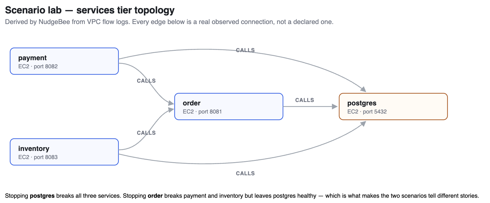
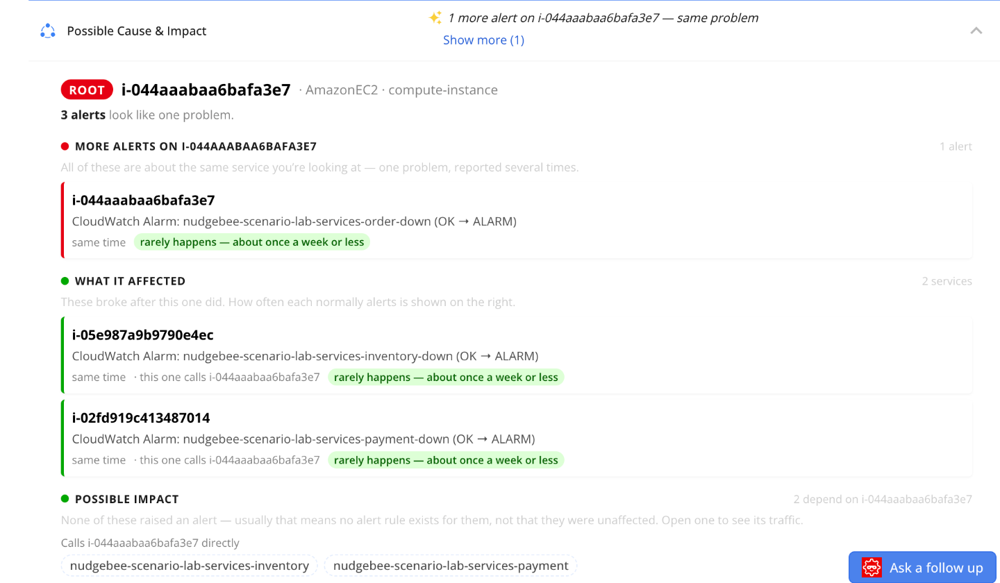
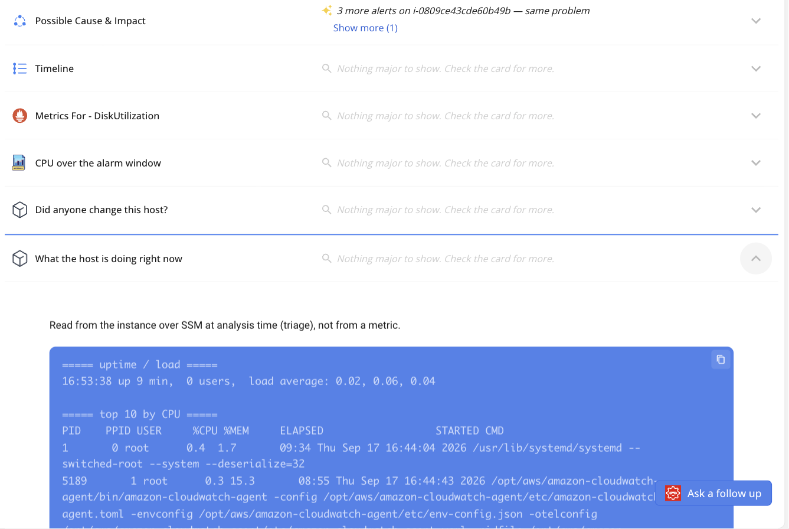
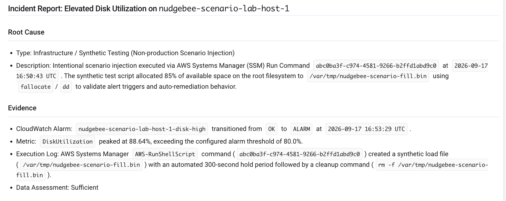

# NudgeBee Scenario Lab — trigger and expectation guide

How to run each fault-injection scenario, what NudgeBee should show when you do, and
which diagnostic automation picks it up.

**Environment:** `aiops.rackspace.com` · tenant `c897a35b-99e9-4347-92ce-c44f71a1a614` ·
cloud account `00666e9f-3774-4f5d-b86c-60b201ae18c5` (AWS `864186153326`, `us-east-1`).

Automation links take two forms and they are not interchangeable:
`…/automation/<id>?accountId=<acct>#editor` is where **Run current** lives — use it to
trigger. `…#executions` is history only. Tables below carry the automation id alone.

---

## 1. The lab

Four CloudFormation stacks, three of which are deployed today.

| Stack | Hosts | Purpose |
|---|---|---|
| `nudgebee-scenario-lab` | `i-0809ce43cde60b49b` — host-1 | Single-host compute faults: cpu, memory, disk, network, process |
| `nudgebee-scenario-lab-db` | `i-09c057a2a0694c337` — db-1 | Standalone PostgreSQL. Database faults in isolation |
| `nudgebee-scenario-lab-services` | order `i-044aaabaa6bafa3e7`, payment `i-02fd919c413487014`, inventory `i-05e987a9b9790e4ec`, database `i-0c25ec78e13d72573` | Three-tier app. The only tier with real service dependencies |
| `nudgebee-scenario-lab-lb` | *(not deployed)* | ALB in front of `order`. Needed for `alb_sg_block` |

Topology of the services tier: `payment → order`, `inventory → order`, and all three → its
own PostgreSQL. Each service's `/health` returns 503 when its own dependency is down, and
burns CPU retrying — so a single fault produces a genuine cascade rather than three injected
faults.



**Which tier to pick.** Compute scenarios on host-1 demonstrate *host diagnostics* — metrics,
processes and logs on one machine. Host-1 is standalone, so it has no service dependencies
and an empty dependency panel there is correct, not a gap. Dependency, correlation and
blast-radius stories belong to the services tier.

---

## 2. How to trigger

### Option A — the UI

Open the automation, press **Run**, accept or edit the inputs, confirm. Progress appears
under the **Executions** tab.

### Option B — the API (what the Run button calls)

```bash
kubectl port-forward -n nudgebee svc/workflow-server 18010:8000

curl -X POST "http://localhost:18010/workflows/<workflowId>/trigger?account_id=00666e9f-3774-4f5d-b86c-60b201ae18c5" \
  -H 'Content-Type: application/json' \
  -H 'x-tenant-id: c897a35b-99e9-4347-92ce-c44f71a1a614' \
  -d '{"instance_id":"i-0809ce43cde60b49b","region":"us-east-1","seconds":"420",
       "account_id":"00666e9f-3774-4f5d-b86c-60b201ae18c5"}'
# -> {"execution_id":"01a0b068-...","workflow_id":"adb8ddcc-..."}
```

Follow it:

```bash
curl "http://localhost:18010/workflows/<workflowId>/executions/<executionId>?account_id=<acct>" \
  -H 'x-tenant-id: <tenant>'
```

### Option C — public, no cluster access

```bash
TOKEN=$(curl -s -X POST https://aiops.rackspace.com/api/auth/token \
  -H 'Content-Type: application/json' \
  -d '{"email":"<service-account>","secret":"<secret>"}' | jq -r .token)

curl -X POST https://aiops.rackspace.com/api/rpc \
  -H "Authorization: Bearer $TOKEN" -H 'Content-Type: application/json' \
  -d '{"jsonrpc":"2.0","id":1,"method":"workflow_execute",
       "params":{"request":{"account_id":"<acct>","id":"<workflowId>",
                 "inputs":{"instance_id":"i-...","region":"us-east-1","seconds":"420"}}}}'
```

Use this one in customer-facing material — it needs no cluster access. The token is
tenant-scoped with a 1-hour TTL.

### Inputs

| Input | Meaning |
|---|---|
| `instance_id` | Target EC2 instance. Every automation already defaults to the right host |
| `region` | `us-east-1` |
| `seconds` | How long to hold the fault. Clamped to 30–1800, default 240–600 per scenario |
| `account_id` | Cloud account |

---

## 3. What to expect, end to end

Measured on `db_service_stopped`, 2026-09-17:

| Elapsed | Event |
|---|---|
| `T+0s` | Workflow starts; `resolve` normalises inputs |
| `T+5s` | `inject` completes — fault is live on the host |
| `T+125s` | CloudWatch alarm OK → ALARM |
| `T+126s` | Event row created in NudgeBee (**1 second** behind the alarm) |
| `T+135s` | Triage and scoring finish; diagnostic automations attach |
| `T+245s` | `revert` restores the host |
| `T+365s` | Alarm returns to OK, event RESOLVED |

**The wait before anything appears is CloudWatch, not NudgeBee.** Alarms are
`Period 60 × EvaluationPeriods 2`, so 120s is the floor. Ingestion latency is ~1 second.

Every scenario reverts three independent ways, all idempotent: the task's own timer, an
on-host failsafe armed *before* the fault (at +60s past the window), and the workflow's
`revert` task. A workflow that dies mid-hold still leaves the host clean.

---

## 4. Flagship walkthrough — `database_outage`

One fault on the services-tier PostgreSQL. Seven alarms follow, but only one is a cause.
This is the run to show if you only show one.

**Automation** `5eac63c0-cc9b-4b88-9ef3-73c58b93ec49` → `i-0c25ec78e13d72573`

### 1. Trigger it

Automations → `scenario-lab-database-outage` → **Run current**. Leave the inputs alone;
`seconds` defaults to 600. The fault is live about five seconds later.

The trigger link must end in `#editor`, not `#executions` — `Run current` lives on the
editor canvas; `#executions` is history only.

### 2. What fires, and in what order

| Elapsed | Alarm | Why |
|---|---|---|
| T+0 | *postgresql stopped* | the only injected fault |
| ~2 min | `services-inventory-cpu` | inventory retries its dead dependency and burns CPU |
| ~3 min | `services-payment-cpu`, `services-order-cpu` | same, on the other two services |
| ~3 min | `services-order-down` | order's `/health` returns 503 because its db check fails |
| ~4 min | `services-payment-down`, `services-inventory-down` | their health checks call order |
| ~5 min | `services-database-down` | the root cause alarms **last** — it needs two missing datapoints |

**The root cause alarms last.** That is the problem this scenario poses: sorted by time,
the first thing you see is the wrong thing.

### 3. Find the events

Troubleshoot → **All Events**, account `aws-dev`. Allow the two-minute CloudWatch delay.

### 4. Grouping — seven alarms, one problem

Open any event, read **Alert group** in the left panel, follow *View Leader Event*. On the
Evidence tab, **Possible Cause & Impact** opens with a line like *"3 alerts look like one
problem"*. The test: does the console show one incident or seven?

### 5. Impact and dependencies



Same card marks one host **ROOT**, lists **What it affected**, and states the relationship
in words — *"this one calls i-044aaabaa6bafa3e7"*. Those edges come from VPC flow logs, not
from anything declared. **Possible impact** then names services that depend on the root but
have not alarmed.

If this section is empty the knowledge graph has not picked up the hosts — that is a graph
problem, not a scenario failure. Check Troubleshoot → Knowledge Graph first.

Verified on the 19:46 run: `dependency_distance` of 1 and 2 on the correlations, including
`likely_root_cause` at 0.83 — *"direct service dependency, downstream fired after upstream
(causal)"*. Before the `CALLS` edges existed every correlation sat at distance 0.

### 6. Diagnostics



The **Evidence** tab fills itself: metrics over the alarm window, what the host is doing now,
whether anyone changed it, resource details, service dependencies. For a database event the
three PostgreSQL workflows attach as well. Nobody runs these by hand — they attach on the
alarm's metric name.

**Investigation Analysis** goes further and writes an incident report:



On the disk-fill event it identified the fault as a synthetic injection and named the SSM
command id, the fill file, the hold period and the cleanup command — reached from evidence,
not from being told.

### 7. Remediation

| Section | What it does |
|---|---|
| **Run an automation** | Runs a saved workflow against this event; lists what has already run |
| **Hand it on** | Creates a ticket. Tracks it outside NudgeBee; changes nothing on the system |
| **Suggested by Nubi** | Generated remediation for this specific event |

Lab events often show *"No fixes are available for this event yet"* — the scenario reverts
itself, so there is rarely anything left to fix by the time you look.

### 8. Resolution

The fault reverts on its own timer and alarms clear over the next few minutes. Set **Triage
Status** to Resolved to close the event. Do not re-run the same scenario within 24 hours —
the second run is marked `DUPLICATE` and links to the first.

---

## 5. Scenario catalogue

Every row's event was traced back to a specific workflow execution, not matched by
timestamp. `#editor` triggers the run; `#executions` shows history.

### Compute tier — host-1 `i-0809ce43cde60b49b`

| Scenario | Automation | Event | Status |
|---|---|---|---|
| `cpu_high` | `34722f51` | `ffe41fe5` | from a 14 Sep run |
| `memory_pressure` | `adb8ddcc` | `8b0d60f3` | verified 17 Sep |
| `disk_fill` | `254047c3` | `8c022df0` | verified 17 Sep |
| `service_failure` | `c595fb1b` | `0b011342` | verified 17 Sep |
| `disk_io_saturation` | `532a2b04` | `d506cb70` | from a 14 Sep run |
| `network_spike` | `bae17b53` | `3fdcc324` | verified 18 Sep — first time this alarm has ever fired |
| `runaway_cron` | `46963855` | `c8f651f2` | verified 18 Sep |
| `zombie_processes` | `0a6a7c0a` | — | shares the CPU alarm; run it alone to attribute an event |

### Database tier — db-1 `i-09c057a2a0694c337`

| Scenario | Automation | Event | Status |
|---|---|---|---|
| `db_service_stopped` | `0803ace7` | `b80debb7` | verified 17 Sep |
| `db_connection_saturation` | `7e601254` | `2c5446bd` | verified 18 Sep |
| `db_blocking_chain` | `19a051d2` | `11f7815a` | verified 18 Sep |
| `db_idle_in_transaction` | `770d7b10` | — | shares the connection alarm; run it alone to attribute |
| `db_port_filtered` | `06f2693c` | — | **no alarm by design** |
| `db_auth_failures` | `912b95ed` | — | **no alarm by design** |

**Why the last two never alarm.** `db_port_filtered` drops packets at `INPUT`, but every
health signal on that host is taken locally — `pg_up` over the local socket, `pg_isready -h
127.0.0.1` — so PostgreSQL correctly reports itself healthy while remote clients hang. The
only way to see it is a remote probe, which is what `order_db_connectivity_loss` provides.
`db_auth_failures` has no metric at all: failed auth moves none of `pg_up`,
`pg_connections_pct` or `pg_blocked_sessions`. Its evidence is SQLSTATE `28P01` in the
PostgreSQL log, nowhere else. A CloudWatch Logs metric filter would give it one, but the
lab does not ship the PostgreSQL log to CloudWatch today.

These two are the strongest diagnostics demos precisely because a monitoring tool sees
nothing at all. `db_service_stopped` vs `db_port_filtered` is the sharpest pair in the lab:
identical symptom class, opposite root cause, and only refused-vs-hung separates them.

### Services tier — three-tier app

| Scenario | Automation | Target | Event | Status |
|---|---|---|---|---|
| `database_outage` | `5eac63c0` | services-database | `2fe94175` | verified — 7 alarms, 11 topology-based correlations |
| `service_failure_cascade` | `ca8c54de` | order | `32d18c48` | verified 18 Sep — 12 topology-based correlations |
| `order_db_connectivity_loss` | `8ce9c82d` | order | — | first successful run 18 Sep; alarm deduped — re-run after 24h |

### Not deployed

| Scenario | Automation | Blocker |
|---|---|---|
| `alb_sg_block` | `7dbf0c6f` | Needs the `lb` tier — `./scripts/deploy.sh lb` |

## 6. Diagnostic automations

Diagnostics attach to an event automatically via an event trigger that allowlists the alarm's
metric name. If a metric is not in the list, the event arrives with **no evidence cards**.

| Automation | Id | Fires on |
|---|---|---|
| `ec2-investigation` | `63711185` | `CPUUtilization`, `StatusCheckFailed*`, `MemoryUtilization`, `DiskUtilization`, `NetworkOut`, `mem_used_percent`, `disk_used_percent`, `FailedSystemdUnits`, `ServiceHealthy` |
| `DB Diagnostics PostgreSQL EC2` | `84308ca6` | `pg_up`, `pg_connections_pct`, `pg_blocked_sessions`, or a `ServiceHealthy` alarm whose name contains `database` |
| `DB Log Analysis PostgreSQL EC2` | `fc8ffd43` | same |
| `DB Connection Troubleshooting PostgreSQL EC2` | `7950d0f0` | same |
| `Application Diagnostic Check` | `d9eeaf7e` | **manual only** |
| `aws-resource-investigation` | `215ca119` | **manual only** |

`Application Diagnostic Check` is the engineer-initiated orchestration entry point — it calls
the compute and database diagnostics and consolidates them. It does not auto-attach to events;
run it from the catalogue with a target.

---

## 7. Known limitations

**EC2 changes are invisible until a bulk sync.** The reactive EventBridge path does not update
EC2 inventory: `EC2 Instance State-change Notification` messages reach the queue, are consumed
and acked, but never match `Resource_Sync_EC2_State_Change`. The sibling ECS rule works, so the
mechanism is sound and the defect is EC2-specific. Until it is fixed, any instance created or
replaced needs a manual sync before NudgeBee can resolve events against it:

```bash
kubectl port-forward -n nudgebee svc/cloud-collector-server 18020:8000
curl -X POST http://localhost:18020/v1/cloud/store_resources \
  -H "X-ACTION-TOKEN: $CLOUD_COLLECTOR_SERVER_TOKEN" \
  -H 'x-tenant-id: c897a35b-99e9-4347-92ce-c44f71a1a614' \
  -d '{"account_id":"00666e9f-...","service_name":"AmazonEC2","regions":["us-east-1"]}'
```

Note the path is `/v1/cloud/` and the `x-tenant-id` header is mandatory.

**Repeat runs within 24h are marked Duplicate.** Occurrence 2+ on the same fingerprint gets
`nb_status = DUPLICATE`. It is still listed and still auto-analysed — only `SUPPRESSED` blocks
analysis — but it links to an earlier parent. For a clean demo, use a scenario that has not run
in the last 24 hours.

**Instance ids are hardcoded in each automation.** Redeploying a stack changes the ids and every
affected automation silently targets a dead host. Re-check targets after any stack update.

**Automations carry their own copy of the scenario script.** `scenarios/catalogue.yaml` is the
source for *new* exports only; editing it does not change an automation already in NudgeBee.

**`host-1-disk-io-high` is orphaned.** Not a member of any stack and still bound to a terminated
instance. It is also a metric-math alarm, so no diagnostic filter can match it. Harmless —
`disk_io_saturation` declares `cpu-high` as its signal — but it should be adopted or deleted.

**Scenarios can silently leave the host dirty.** `service_failure` removed its unit file but
never called `systemctl reset-failed`, so systemd kept a `not-found failed` entry and
`host-1-service-down` stayed in ALARM for three hours after a run that reported COMPLETED.
Fixed in `catalogue.yaml` and the live definition. The general lesson: a green workflow does
not prove a clean revert — check the alarm went back to OK.

**The knowledge-graph build lock is tenant-wide and lasts an hour.** It is stamped at build
*start*, so after changing infrastructure the order matters: sync resources first, then
clear `knowledge_graph_tenant_filters.last_process_started_at`, then trigger the build.
Doing it the other way round means the build reads a snapshot taken before your change and
you wait an hour for the next attempt.

**Percentage arguments are not always what they look like.** `stress-ng --vm-bytes 60%` held
about 110MB of a 913MB host, not 60% of it. `memory_pressure` now computes an absolute
target from `free -m` instead. Prefer arithmetic you can read over a flag you have to trust.
