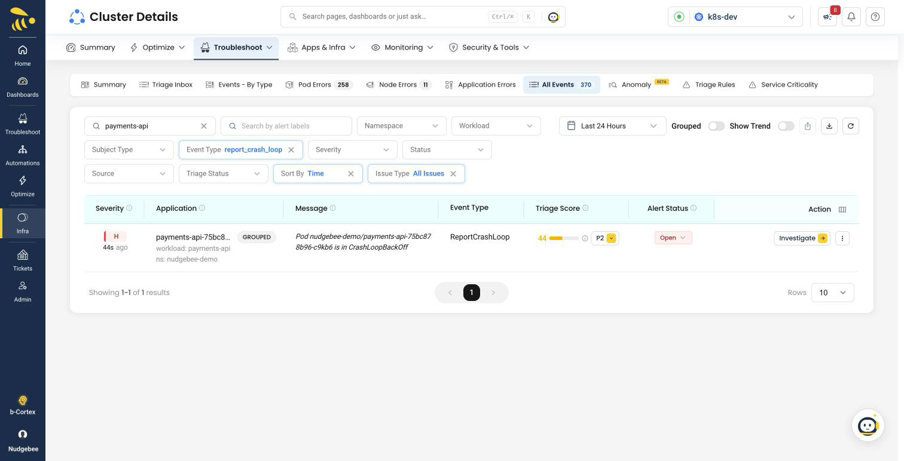
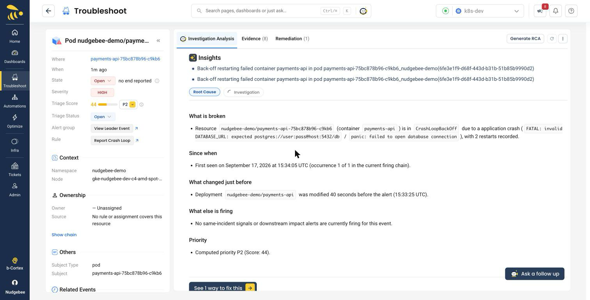
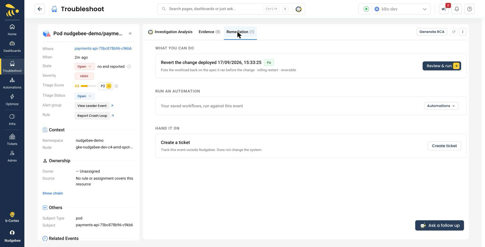
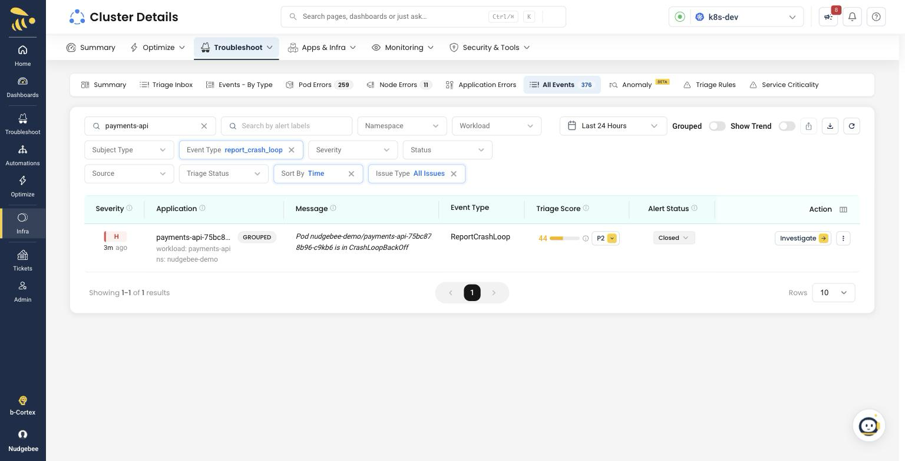

# CrashLoopBackOff — a service that won't start

A service is running fine. Someone changes a config value. Thirty seconds later
it's restarting in a loop, and `kubectl get pods` tells you `CrashLoopBackOff`
— which is a description of the symptom, not a reason.

This scenario creates exactly that, and lets you watch NudgeBee work backwards
from it.

```bash
./run.sh break
```

## What it does

1. Deploys `checkout-api` and waits for it to be **healthy**
2. Changes one value — `DATABASE_URL` goes from a connection string to a bare hostname
3. The container reads it, fails, and exits. Kubernetes restarts it. Repeat.

The healthy step matters. Starting from an already-broken Deployment gives you a
pod that has never worked and no change to point at — which is not what a real
incident looks like, and makes the interesting question unanswerable.

## The naive answer

> The pod is crashing. Restart it, or roll back the deployment.

Restarting changes nothing — it crashes again. Rolling back is *closer* to right
but it's a guess: you don't yet know the change caused this, which change it
was, or whether the rollback takes anything else with it.

**The question worth asking is: what changed, when, and is that why?**

## What you should see

### 1. The alert

Within about a minute, under **Troubleshoot → Pod Errors**.



It stays open while the pod keeps crashing. An alert that closes itself while
the problem is still happening is worse than no alert.

### 2. The investigation



Three things worth pointing at here:

- **The reason, from the logs** — not "the container exited", but the actual
  error the process printed on its way out, and how many restarts it has done.
- **What changed just before** — the config change on the Deployment, with a
  timestamp and the gap to the alert. This is the link between symptom and cause
  that you would otherwise assemble by hand from `kubectl rollout history` and a
  guess about timing.
- **What else is firing** — on a quiet cluster this says there is nothing else,
  which is itself an answer: the blast radius is one workload. On a busy one it
  lists the alerts that went off around the same time, so you see the shape of
  the incident rather than one row of it.

### 3. The fix



One action: **revert the change**, back to the spec the workload ran before.
Rolling restart, reversible, and you review it before it runs.

Let NudgeBee do it, or do it yourself:

```bash
./run.sh fix
```

### 4. Resolved



The alert closes once the workload is genuinely healthy again — under a minute
on the run these screenshots come from.

Note what did *not* happen: it stayed open for the whole time the pod was
crashing, which is less obvious than it sounds. A CrashLoopBackOff pod is
briefly Running, and briefly Ready, on every restart. Closing on that would mark
the incident resolved while it is still going on.

## Running it again

```bash
./run.sh break     # restarts the agent, then runs the scenario again
```

The agent holds one alert per workload per hour so a crashlooping pod doesn't
alert on every backoff cycle. That window is kept in the runner's memory, so
`break` restarts the runner to clear it before running.

On a cluster where restarting the agent isn't acceptable — anywhere with real
workloads on it — skip the restart and use a name you haven't used in the last
hour:

```bash
SKIP_AGENT_RESTART=1 APP=checkout-api-2 ./run.sh break
```

Restarting the agent clears the suppression for *every* workload, not just this
one, so anything already broken in the cluster can alert again on the restart.
On a clean test cluster that's nothing. Elsewhere it's a surprise.

## Cleaning up

```bash
./run.sh cleanup     # deletes the namespace
```

## Options

| Variable | Default | Why you'd change it |
|---|---|---|
| `NS` | `nudgebee-demo` | Namespace to create and delete |
| `APP` | `checkout-api` | Workload name — change it to run again without restarting the agent |
| `IMAGE` | `busybox:1.36` | Any image with a shell. Change it if the cluster can't pull from Docker Hub — an image it can't pull gives you `ImagePullBackOff`, a different scenario |
| `SKIP_AGENT_RESTART` | unset | Set to `1` to leave the agent alone |
| `AGENT_NS` / `AGENT_DEPLOY` | auto-detected | Set if the agent isn't found automatically |

## Commands

| | |
|---|---|
| `./run.sh break` | Deploy healthy, then break it |
| `./run.sh fix` | Revert the config change |
| `./run.sh status` | Agent, workload and current config value |
| `./run.sh cleanup` | Delete the namespace |
